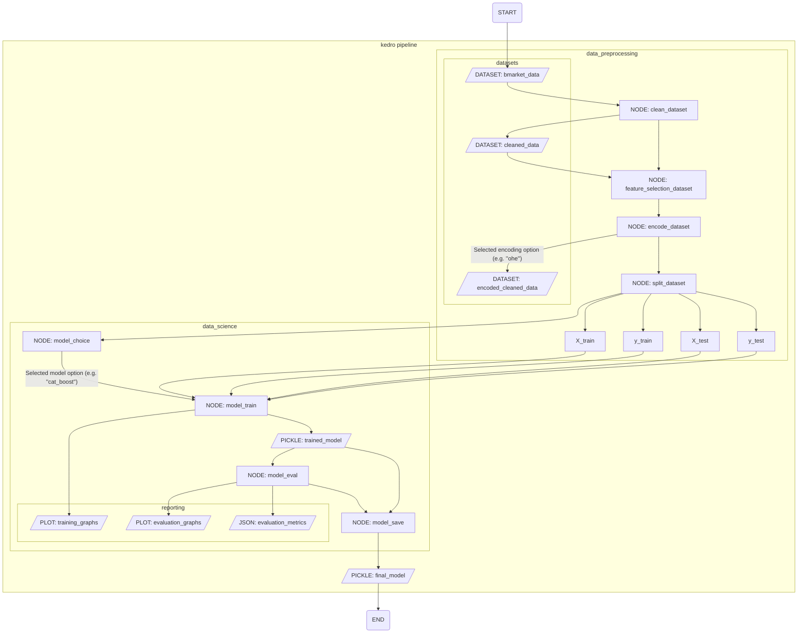

# EGT309-TeamJunHoe

## Section A - Contributors

### Foo Tun Wei Darren - 231725Z@mymail.nyp.edu.sg
- Data cleaning & preprocessing: Age, Campaign Calls, Education Level, Contact Method, Occupation
- Feature analysis: Univariate analysis for above columns
- Kedro pipeline development: Overall data Preprocessing pipeline, Overall data Science pipeline, Configuration approach
- Model tuning methods: Grid search, Bayesian optimisation
- Model evaluation methods: Confusion matrix visualisation

### Harish Kanna - 230268R@mymail.nyp.edu.sg
- Data cleaning & preprocessing: Marital Status, Previous Contact Days, Credit Default, Personal Loan, Housing Loan
- Feature analysis: Bivariate analysis, Feature selection, Univariate analysis for above columns
- Kedro pipeline development: Model registry, Model interface (Structural Subtyping)
- Model tuning methods: Threshold tuning
- Model evaluation methods: Evaluation metrics decision-making, Weight geometric mean scoring (metric)

## Section B - Folder Structure

```
# Comments highlight directories and files not in base kedro structure

EGT309-TEAMJUNHOE
├── conf
│   ├── base
│   │   ├── catalog.yml
│   │   ├── parameters_datapreprocessing.yml
│   │   └── parameters_datascience.yml
│   ├── local
│   ├── logging.yml
│   └── README.md
├── data
│   ├── 01_raw
│   ├── 02_cleaned
│   └── 08_reporting
├── Dockerfile-eda   --- Dockerfiles used to containerize dev and testing
├── Dockerfile-kedro
├── eda.ipynb
├── pyproject.toml
├── README.md
├── requirements.txt
├── run.sh
├── saved_models   --- Contains subdirectories for each of the three model choices
│   ├── cat_model  --- Each subdirectory contains one final model
│   ├── light_model
│   └── xgb_model
└── src
    └── egt309_teamjunhoe
        ├── pipelines
        │   ├── data_preprocessing
        │   ├── data_science
        │   │   └── models       --- Model classes, model interface and model registry
        └── settings.py

```
## Section C - Instructions

Make sure your working directory is always the base directory of the entire repository, which should be ./EGT309-TeamJunHoe when cloned. All commands are structured around running them from the base directory.

### EDA
Run `docker build --no-cache -t eda -f Dockerfile-eda .` to build the jupyter server image
Run `docker run -d -p 8888:8888 eda` to start the jupyter server and use it as the jupyter kernel in your preferred IDE

### Kedro Pipeline
Run `run.sh` to run the finalized pipeline. Ensure Docker is installed and available in your system for `run.sh` to work.

Modify parameters used in the data_preprocessing pipeline in `conf/base/parameters_datapreprocessing.yml`

There are four categories of data preprocessing parameters:
1. `cleaning_params` - Parameters for data cleaning
2. `feature_selection_params` - Parameters for selecting top N features and ranking of features
2. `encoding_params` - Parameters for data encoding (e.g. OHE / LabelEncoding)
3. `splitting_params` - Parameters data splitting

Modify parameters used in the data_science pipeline in `conf/base/parameters_datascience.yml`

Under the top level model_params key, every type of model has their own section (e.g. cat_boost_settings)

The top of the model_params section has other global values to be selected such as model choice.

Possible parameters are shown as comments above parameters when helpful.

## Section D - Pipeline

### Flowchart



### Explanation for each node in the kedro pipeline (in sequence)

| Node | Function | Input(s) | Output(s) |
| :---: | :--- | :---: | :---: |
| clean_dataset |  Cleans the dataset according to the methods and algorithms created in eda.ipynb. Some parameters can be configured from the parameters.yml | bmarket_data (SQLTableDataset) | cleaned_data (ParquetDataset) |
| feature_selection_dataset | Remove columns starting from least important based on the ranking defined inside parameters.yml. Number of columns to drop can be configured inside parameters.yml | cleaned_data (ParquetDataset) | feature_selected_data (InMemory) |
| encode_dataset | Encode the dataset based on the specified encoding strategy inside parameters.yml ("ohe", "label", "none") | feature_selected_data (InMemory) | encoded_cleaned_data (ParquetDataset) |
| split_dataset | Stratified split the dataset into training and testing splits. Has functionality for imbalance handling and can be configured from the parameters.yml | encoded_cleaned_data (ParquetDataset) | X_train, y_train, X_test, y_test (InMemory) |
| model_choice | Initialises the chosen model as specified within the parameters.yml. ("decision_tree", "cat_boost", "ada_boost", etc.) | No dataset input | model_choice (InMemory) |
| model_train | Trains the model according to the training strategy specified in parameters.yml. Training methods differ depending on the model choice. | X_train, y_train, model_choice (InMemory) | trained_model (PickleDataset), training_graphs (MatplotlibDataset) |
| model_eval | Evaluates the model and generates a classification / metric report and plots an evaluation graph | trained_model (PickleDataset), X_test, y_test (InMemory) | evaluation_metrics (JSONDataset), evaluation_graphs (MatplotlibDataset) |
| model_save | Saves the model to the saved_models directory | trained_model (PickleDataset) | None (Saves model to directory) |

## Section E - EDA Overview
The following are some of the main insights and problems we found through Exploratory Data Analysis, and a brief overview of how we dealt with them.

### Many High-Cardinality Categorical Features
Over half of all columns are of a categorical type, and the number of unique classes in a column goes up to 12 at max. Multiple options were created for encoding these columns, which is not only for experimentation but also because different encoding types work better for different models. One-Hot encoding works best with XGBoost, Label Encoding for LightGBM, and no encoding for CatBoost (it uses it's own encoding internally). As such, the pipeline can dynamically change the type of encoding used with a configurable option in the parameters_datapreprocessing.yml file to cater to different models' needs.

### Very imbalanced dataset
The majority class comprises 88% of the entire dataset, which is a harsh imbalance that must be addressed in some way. While both undersampling and oversampling were implemented as choices in the pipeline, the final choice was just to stratify the classes while splitting the data. Oversampling methods like SMOTE would not work well on the complex data, while undersampling would get rid of important data that the model would benefit from having access to for learning.

### Outlier handling
One column featured many outlier values, the Age column (150 years), initially we decided to change all the outliers to -1, to signify that the age is unknown. However, the final choice was to impute the outlier values based on data from other columns (occupation, education level, marital status, credit default, and contact method). Which was successful as the distribution after imputation was able to precisely replicate the original distribution.

### Null value handling
Two of the columns, Housing Loan and Personal Loan, contained null values. Neither of these columns were correlated with any other column, making accurate imputation possible. Housing Loan especially had over 60% of missing data which will make any form of imputation very likely to be wrong, hence all missing values were filled with the value 'missing'. Personal Loan only had around 10% of missing data, and the mode of the column 'no' had a very high percentage, hence mode imputation was used for it.

### Inconsistent value handling
The Contact Method column had more unique values due to inconsistent entry of data than classes that actually existed. Both 'cellular' and 'telephone' were entered in two different ways, which was collapsed to one unique class each.

### Lack of values in certain classes for some columns
The Occupation column had a large number of unique classes, which resulted in some classes having a low number of data points. The Credit Default column only had 3 unique classes, but the 'yes' class only had 3 data points in the entire dataset. Models are prone to overfitting on these classes with few samples, hence feature engineering was used to combine some classes and increase the number of samples per class in each column. Occupation was generalized into 'employed' and 'not employed', while Credit Default was generalized into 'known' and 'unknown'.

### Data entry error handling
The Campaign Calls column featured many data entry errors, with many of its values being negative numbers. This was handled through statistical analysis with the Kolmogorov-Smirnov test (2 sample K-S test), which helped to prove that the negative and positive sample spaces were likely from the same distribution. Hence, the final decision of moving the negative numbers into the positive space throught the absolute function.

### Feature analysis
Bivariate analysis between each feature and the target was performed to understand the relationship between them. Some features like previously_contacted displayed very strong performance in helping distinguish whether the client subscribed or not, while other features like personal_loan showed little to no ability to help predict the target. Using this, a naive ranking of features was created so that the top N features could be selected in the pipeline in case trimming features that have less correlation would be helpful.

## Section F - Data Processing Overview

This section primarily explains the (default) main data processing steps for each column of the dataset.

| Column Name | Processing Steps |
|:---:|---|
| AGE | Data processing done by changing outlier ages (150 yrs old) via KNN imputation based on specific other columns |
| MARITAL STATUS | No data processing |
| OCCUPATION | Occupation column generalized to new boolean 'employed' column |
| EDUCATION | No data processing, some categories changed to easier to read format |
| CONTACT METHOD | Combined overlapping values |
| CAMPAIGN CALLS | Changed all negative values to positive |
| PREVIOUS CONTACT DAYS | Created new boolean column to denote 999 as 'not previously contacted' |
| CREDIT DEFAULT | Combined 'yes' and 'no' into 'known' |
| HOUSING LOAN | Changed null values to "missing" |
| PERSONAL LOAN | Imputed null values via mode imputation |

## Section G - Model Choice
### CatBoost
CatBoost was the first choice as it is specifically built to handle datasets with many categorical columns. It uses a special encoding type called 'Ordered Target Encoding'. It does not create many new columns like One-Hot Encoding, and assigns numeric values instead to each class like Label Encoding. However, Label Encoding only does a simple naive class mapping that has no real semantic meaning, while Target Encoding uses the relationship between each class of a column and the target column to assign numeric values that have real meaning the model can capitalize on using comparison operators like a normal numeric column.

### LightGBM
LightGBM was the second choice due to its efficiency and speed in training that enables much faster hyperparameter tuning, especially as we continuously attempt to improve the model performance by widening the search spaces. LightGBM achieves this by bundling features together into Exclusive Feature Bundles (EFBs) to reduce computation required, but uses complex algorithms to ensure that this compression of features is lossless and does not affect accuracy.

### XGBoost
Our final choice was XGBoost due to its baseline powerful performance and robustness across tabular dataset problems. XGBoost stands its ground by pushing more standard features to their max performance, such as having highly advanced regularization to prevent overfitting. XGBoost is commonly included as a comparison model for these purposes, and we wish to also use XGBoost to check if our strategies with CatBoost and LightGBM actually lead to better performance.

## Section H - Model Evaluation

### Main metrics for model evaluation:
| Ranking | Metric | Definition | Formula | Reasoning |
| :---: | :---: | :--- | :--- | :--- |
| 1 | Weighted Geometric Mean (GMS) | Weighted geometric mean of recall and specificity that favors recall | `GMS = Recall^0.6 * Specificity^0.4` | Maximize recall while ensuring specificity is not fully abandoned |
| 2 | Recall | How many of total positives were correctly identified as positives | `Recall = TP / (TP + FN)` | The cost of not selecting (false negative) a customer is greater than the cost of getting a false positive |
| 3 | Specificity | How many of total negatives were correctly identified as negatives | `Specificity = TN / (TN + FP)` | Specificity needs to be reasonable such that the bank can confidently filter out customers identified as unlikely to subscribe |
| 4 | AUC (Area Under the ROC Curve) | Measures model’s ability to distinguish between classes across all thresholds | N/A (calculated from ROC curve) | Since threshold tuning is done with GMS, AUC is used to measure model performance independently of threshold tuning

### Evaluation of CatBoost
"weighted_gmean": 0.6908271380513155,
"sensitivity (recall)": 0.7370689655172413,
"specificity": 0.6268466168156119,
"roc_auc": 0.7381113724553006

CatBoost performs the best, slightly edging out LightGBM with a slightly higher GMS. This is most likely due to CatBoost being specialized at dealing with categorical columns. CatBoost seems to show better performance the more features it has, so a follow up to improving performance might be to come up with more engineered columns.

### Evaluation of LightGBM
"weighted_gmean": 0.6863668183792349,
"sensitivity (recall)": 0.728448275862069,
"specificity": 0.6277585263541857,
"roc_auc": 0.7430604470243449

LightGBM interestingly has a higher AUC score despite a lower GMS, meaning that it is better at discriminating classes overall but benefits less from threshold tuning than CatBoost. LightGBM's advantage is its raw training speed, and the best follow up for it would be to increase the search space for hyperparameter tuning.

### Evaluation of XGBoost
"weighted_gmean": 0.6700789701560874,
"sensitivity (recall)": 0.7112068965517241,
"specificity": 0.6128032099215758,
"roc_auc": 0.7248749268900111

XGBoost falls one step short compared to CatBoost and LightGBM across all metrics, but still boasts competitive performance overall. XGBoost would benefit from more careful hyperparameter tuning beyond just simple automated search spaces as it has a wide array of hyperparameters that can easily swing model performance up and down.

### Other follow-up suggestions
- Ensembling: CatBoost and LightGBM show different strengths, which ensembling can leverage to increase performance via voting.
- Preventing overfitting: While CatBoost trains using a validation set to prevent overfitting, LightGBM and XGBoost do not. Adding methods to use the model with the best validation score instead of the final model after fully training might benefit them.

## Section I - Other Considerations

### Further Threshold tuning
The model currently will predict more positives, which prevents customers likely to subscribe from being falsely classified as negative but also leads to more false positives and waster resources. The threshold should be tuned using the GMS based on which is more costly or how many resources the bank is willing to allocate in future campaigns.

### Binning probabilities into smaller target classes
While the model is a binary classification model that predicts 0 or 1, it still predicts raw probabilities first that the bank can actually use to bin them into smaller categories like 'unlikely', 'neutral', and 'very likely'. This gives the bank more control over the amount of customers they want to call, an example being they can call everyone in the 'very likely' category first and use leftover time to call customers in the 'neutral' category, instead of immediately discarding all customers even if they were predicted to be a much higher value that was just below the threshold.