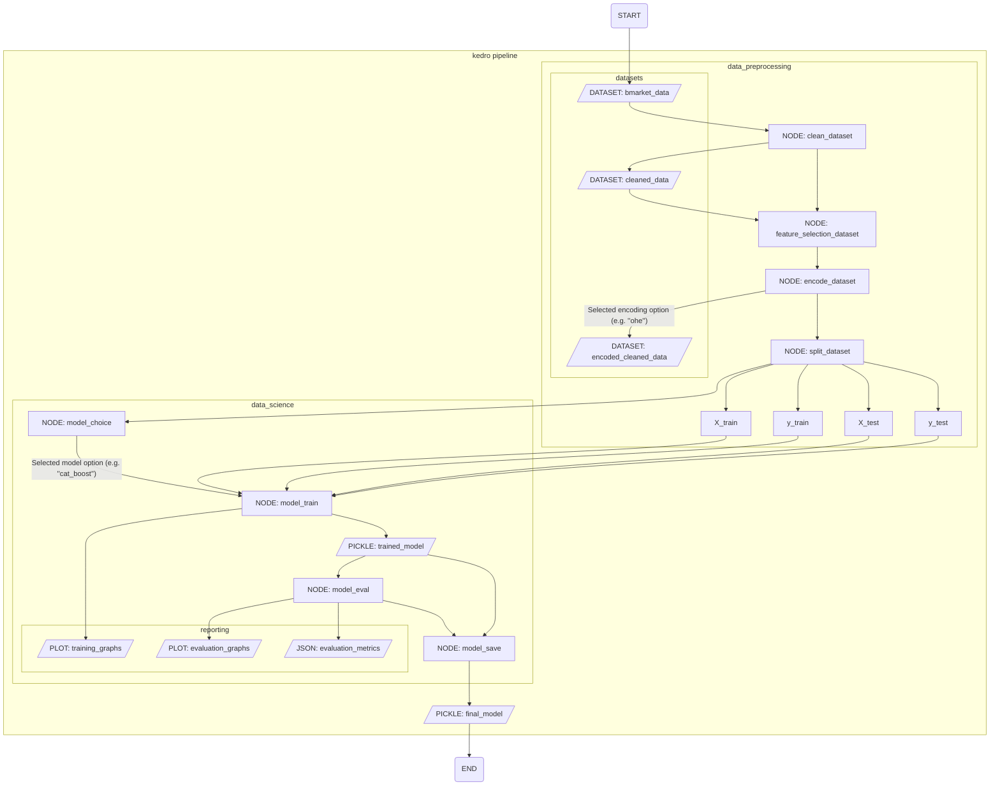

# EGT309-TeamJunHoe

## Section A - Contributors

### Foo Tun Wei Darren - 231725Z@mymail.nyp.edu.sg

### Harish Kanna - 230268R@mymail.nyp.edu.sg

## Section B - Folder Structure

```
EGT309-TEAMJUNHOE
├── conf
│   ├── base
│   └── local
├── data
│   ├── 01_raw
│   ├── 02_cleaned
│   ├── 06_models
│   │   └── trained_model
│   └── 08_reporting
├── saved_models
└── src
    └── egt309_teamjunhoe
        └── pipelines
            ├── data_preprocessing
            └── data_science
                └── models

17 directories
```
## Section C - Instructions

Run `run.sh` to run the finalized pipeline

Modify parameters in `conf/base/parameters.yml`

There are three categories of parameters:
1. `data_cleaning_parameters` - Parameters for data cleaning
2. `encoding_params` - Parameters for data encoding (e.g. OHE / LabelEncoding)
3. `model_params` - Parameters for the ML model pipeline

All editable parameters are included in the `parameters.yml` file. Possible parameter inputs are also included in the file.

## Section D - Pipeline



## Section E - EDA Overview

## Section F - Data Processing Overview

This section primarily explains the (default) main data processing steps for each column of the dataset.

| Column Name | Processing Steps |
|:---:|---|
| AGE | Data processing done by changing outlier ages (150 yrs old) via imputation (configurable) |
| MARITAL STATUS | No data processing |
| OCCUPATION | No data processing, some categories changed to easier to read format |
| EDUCATION | No data processing, some categories changed to easier to read format |
| CONTACT METHOD | Combined overlapping values |
| CAMPAIGN CALLS | Changed all negative values to positive |
| PREVIOUS CONTACT DAYS | Created new boolean column to denote 999 as "not previously contact" |
| CREDIT DEFAULT | No data processing |
| HOUSING LOAN | Changed null values to "missing" |
| PERSONAL LOAN | Imputed null values via mode imputation (configurable) |

## Section G - Model Choice

## Section H - Model Evaluation

## Section I - Other Considerations